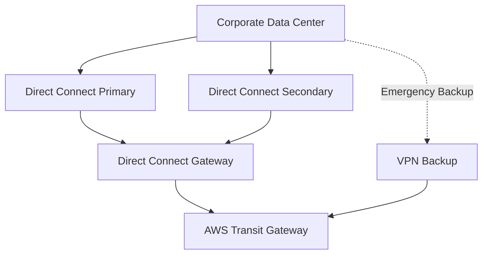

## DX + VPN Resiliency Architecture

```mermaid
flowchart TB

DC["Corporate Data Center"]

DX1["Direct Connect Primary"]
DX2["Direct Connect Secondary"]

DXGW["Direct Connect Gateway"]

VPN["VPN Backup"]

TGW["AWS Transit Gateway"]

DC --> DX1
DC --> DX2

DX1 --> DXGW
DX2 --> DXGW

DXGW --> TGW

DC -. Emergency Backup .-> VPN

VPN --> TGW
```