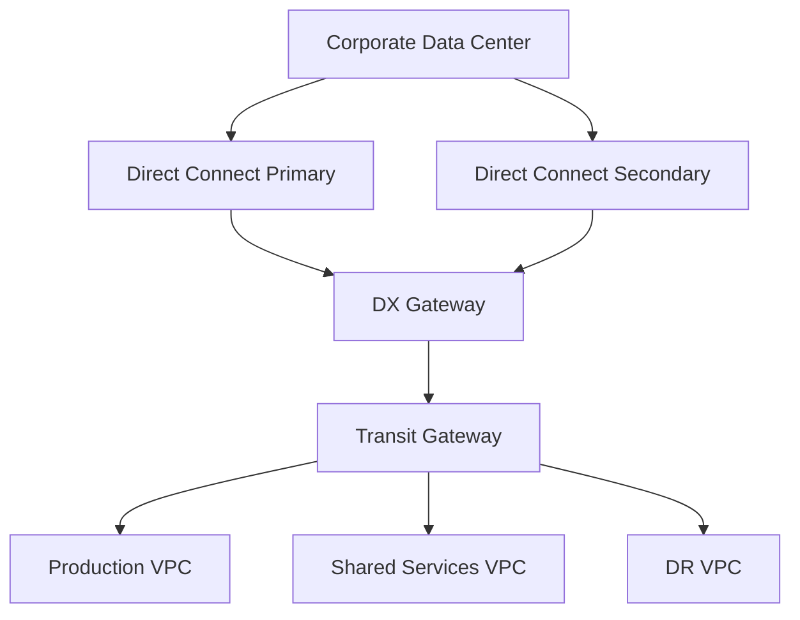

## Enterprise Direct Connect Architecture

```mermaid

flowchart TB

DC[Corporate Data Center]

DC --> DX1[Direct Connect Primary]

DC --> DX2[Direct Connect Secondary]

DX1 --> DXGW[DX Gateway]

DX2 --> DXGW

DXGW --> TGW[Transit Gateway]

TGW --> PROD[Production VPC]

TGW --> SHARED[Shared Services VPC]

TGW --> DR[DR VPC]
```