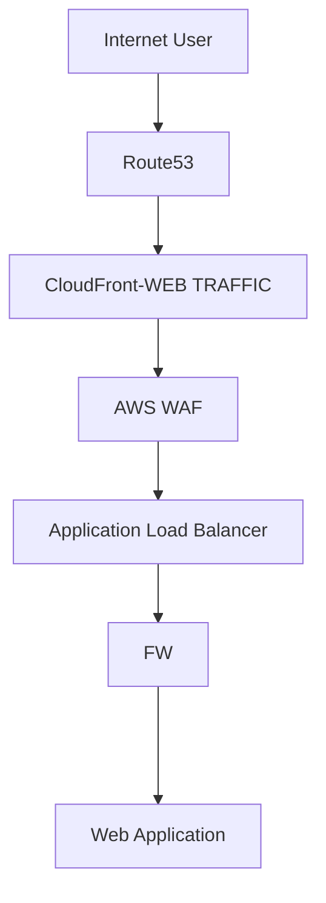

## Edge Security Flow

```mermaid

flowchart TB

USER[Internet User]

USER --> DNS[Route53]

DNS --> EDGE[CloudFront-WEB TRAFFIC]

EDGE --> WAF[AWS WAF]

WAF --> ALB[Application Load Balancer]

ALB --> FW

FW ---> APP[Web Application]
```

Edge        : Route 53, CloudFront, AWS WAF, shield

Region      : ALB, NLB, Target group

Inspection  : Gateway LB, Network Firewall

Private App : Private subnet