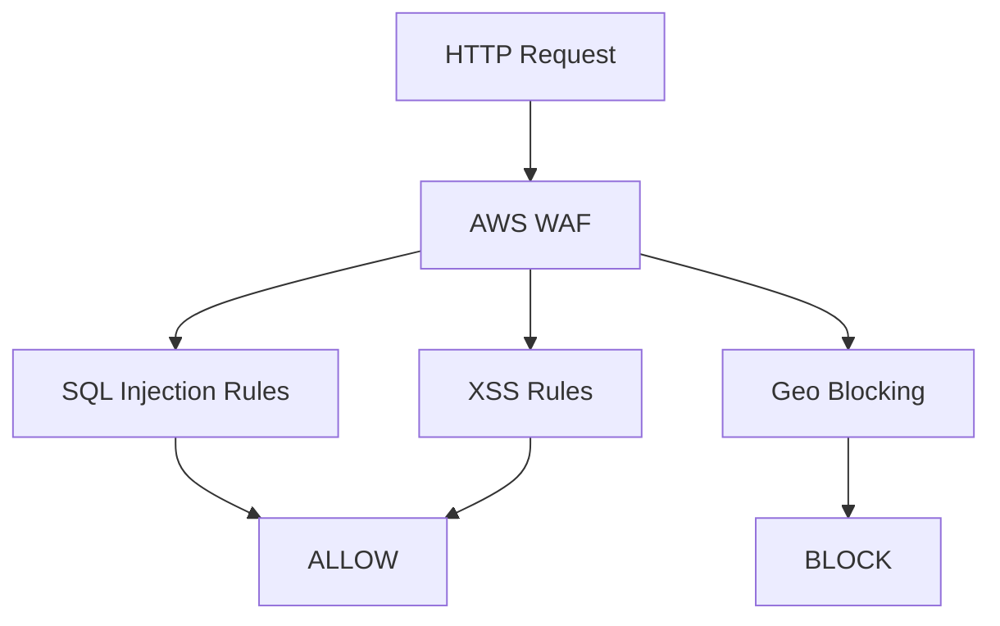

##  WAF Inspection Flow

```mermaid

flowchart TB

REQUEST[HTTP Request]

REQUEST --> WAF[AWS WAF]

WAF --> SQLI[SQL Injection Rules]

WAF --> XSS[XSS Rules]

WAF --> GEO[Geo Blocking]

SQLI --> ALLOW

XSS --> ALLOW

GEO --> BLOCK
```
