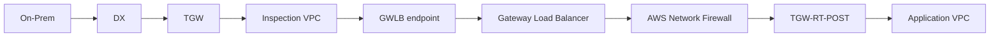

## Centralized Inspection

```mermaid

flowchart LR

ONPREM[On-Prem]

ONPREM --> DX

DX --> TGW

TGW --> INSPECTION[Inspection VPC]

INSPECTION --> GWLB_ENDPOINT[GWLB endpoint]

GWLB_ENDPOINT --> GWLB[Gateway Load Balancer]

GWLB --> FW[AWS Network Firewall]

FW --> TGW_POST[TGW-RT-POST]

TGW_POST --> PROD[Application VPC]
```