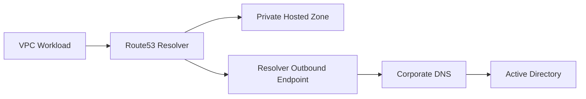

## Enterprise DNS Architecture

```mermaid

flowchart LR

WORKLOAD[VPC Workload]

WORKLOAD --> R53[Route53 Resolver]

R53 --> PHZ[Private Hosted Zone]

R53 --> OUTBOUND[Resolver Outbound Endpoint]

OUTBOUND --> ONPREM[Corporate DNS]

ONPREM --> AD[Active Directory]
```