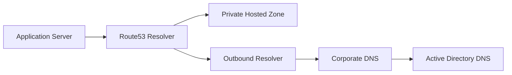

## Enterprise DNS

```mermaid 

flowchart LR

USER[Application Server]

USER --> R53[Route53 Resolver]

R53 --> PHZ[Private Hosted Zone]

R53 --> OUTBOUND[Outbound Resolver]

OUTBOUND --> ONPREM[Corporate DNS]

ONPREM --> AD[Active Directory DNS]
```