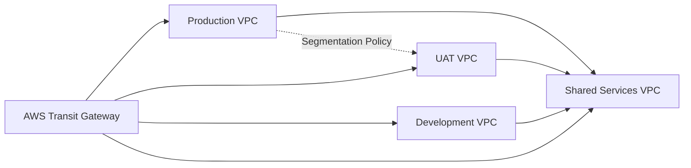

## Network Architecture

```mermaid

flowchart LR

TGW["AWS Transit Gateway"]

PROD["Production VPC"]
UAT["UAT VPC"]
DEV["Development VPC"]

SHARED["Shared Services VPC"]

TGW --> PROD
TGW --> UAT
TGW --> DEV

TGW --> SHARED

PROD --> SHARED
UAT --> SHARED
DEV --> SHARED

PROD -. Segmentation Policy .-> UAT
```