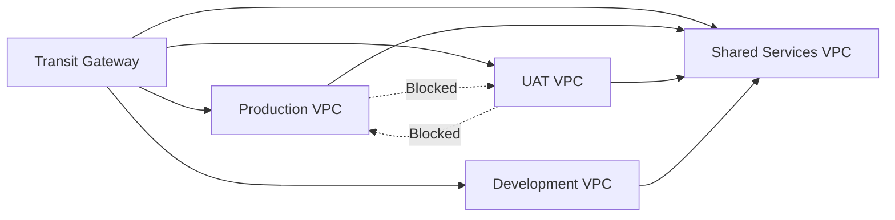

## Transit Gateway Routing

```mermaid 

flowchart LR

TGW[Transit Gateway]

TGW --> SHARED[Shared Services VPC]

TGW --> PROD[Production VPC]

TGW --> UAT[UAT VPC]

TGW --> DEV[Development VPC]

PROD -.Blocked.-> UAT

UAT -.Blocked.-> PROD

PROD --> SHARED

UAT --> SHARED

DEV --> SHARED
```